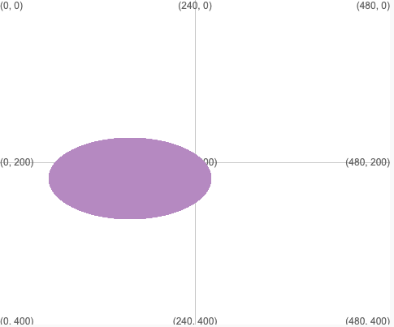

Lluniwch gylch neu elips gan ddefnyddio: `ellipse(x, y, lled, uchder)`

Bydd yr elips yn cael ei lunio gan ddefnyddio'r gwerthoedd strôc a llenwi sydd wedi'u gosod cyn galw `ellipse`.

--- code ---
---
language: python
filename: main.py
---

  ellipse(160, 220, 200, 100) # x, y, lled, uchder

--- /code ---

Bydd yr elips wedi'i ganoli yn y cyfesurynnau (x, y) sy'n cael eu rhoi gan y ddau rif cyntaf.

Y trydydd rhif yw lled yr elips a'r pedwerydd yw ei uchder.

I lunio cylch, gwnewch y lled a'r uchder yr un fath.

